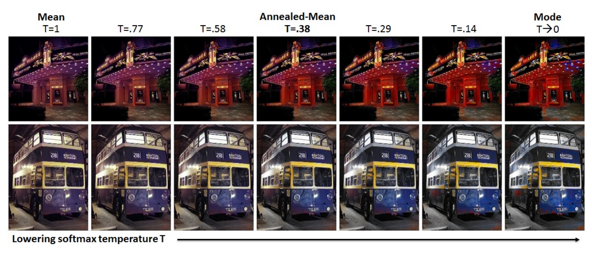

# Colorful Image Colorization
Implementation of Colorful Image Colorization by Richard Zhang.

[Paper](https://arxiv.org/abs/1603.08511) - [Code](https://github.com/richzhang/colorization) - [YouTube](https://www.youtube.com/watch?v=4xoTD58Wt-0) - [Website](https://richzhang.github.io/colorization/)

## Main ideas
### Objective Function
Not the Euclidean Loss, but Multinominal Cross Entropy Loss.


### Class Rebalancing
Observe that the number of pixels in natural images at desaturated values are orders of magnitude higher than for saturated values. Therefore, the loss function is dominated by desaturated ab values.


### Class Probabilities to Point Estimates
Not mode of the predicted distribution for each pixel, not its mean, but its annealed-mean.





## Dataset
- ImageNet from Kaggle: [link](https://towardsdatascience.com/downloading-and-using-the-imagenet-dataset-with-pytorch-f0908437c4be).

## Reference
- [ ] https://github.com/sizhky/Colorization
- [x] https://github.com/nku-shengzheliu/Pytorch-Colorful-Image-Colorization
- [x] https://github.com/87003697/colorful_image_colorization_pytorch
- [ ] https://github.com/yasamanhbn/Image-Colorization
- [ ] https://github.com/luxiya01/deep-coloring
- [ ] https://github.com/dtpreda/colorful
- [ ] https://github.com/stanleynguyen/corolization

## Inference example
Create **exp01** folder:
```
!python demo_release.py -i dog_gray.jpeg -o exp01/dog
```

```
exp01:
  dog_eccv16.png
  dog_siggraph17.png
```
