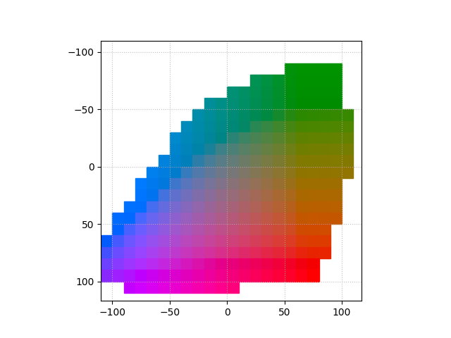

# Draw RGB graph

Figure 3 (a). Quantized ab color space with a grid size of 10. A total of 313 ab pairs are in gamut. 



Explanation for [add_patch](https://matplotlib.org/stable/api/_as_gen/matplotlib.patches.Rectangle.html) in ```draw_rgb_graph.py```.
